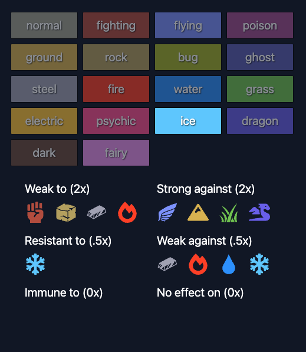

# Pokemon Type Checker

This application is a Pokémon Type Checker that allows users to explore and interact with different Pokémon types. 

Built with React, it leverages @tanstack/react-query for efficient data fetching and management, ensuring a smooth and responsive user experience. The UI is styled using TailwindCSS, providing a modern and visually appealing design. 

Users can select different Pokémon types to see their strengths, weaknesses, and immunities, with data fetched from the PokéAPI. The app also includes interactive elements like type icons and buttons, enhancing user engagement. 

Development is streamlined with Vite for fast builds and a development server, and TypeScript is used throughout the codebase to ensure reliability and maintainability.



```
npm i
npm run dev
```

## Stack

### Core Frameworks and Libraries:

- React: For building interactive user interfaces.
- @tanstack/react-query: Efficiently fetching and managing Pokémon data.
- TailwindCSS: For responsive and visually appealing UI design.
- React Icons: Adding iconography for better visual representation.
  
### Development Tools:

- Vite: Fast build and development server for optimal performance.
- TypeScript: Enhancing code reliability and maintainability.
